# tmr

I'm the worst person to create good names... So, TMR ( Terminal Markdown Reader )

A fast, low-footprint terminal UI for browsing, reading and editing
Markdown notes — a small productivity engine for text in the terminal,
with Markdown as its first supported format.

```
+ FILES ---------------------++ DOCUMENT ------------------------------------+
| sub/                       || # Welcome                                   |
| note1.md                   || This is a test note with emphasis, inline   |
| note2.md                   || code, and a link.                          |
|                            || ## Tasks                                    |
|                            || [ ] first task                              |
|                            || [x] second task                             |
+----------------------------++----------------------------------------------+
+ STATUS -----------------------------------------------------------------------+
| note1.md  tab focus · enter open/edit · space toggle · / search · q quit      |
+---------------------------------------------------------------------------------+
```

## Install / Build

Requires a Rust toolchain (stable, 2021 edition; developed against 1.98).

```sh
git clone <this repo> tmr
cd tmr
cargo build --release
# binary at target/release/tmr
```

Optionally put it on your `PATH`:

```sh
install -m 755 target/release/tmr ~/.local/bin/tmr
```

Or use `./setup.sh` to do all of the above interactively — see
[Development](docs/development.md).

## Run

```sh
tmr              # opens the current working directory
tmr ~/notes       # opens a specific directory
tmr sandbox       # try it risk-free, see sandbox/README.md
tmr --help
```

If no directory is given, tmr uses `[workspace] default_dir` from
`config.toml` if set, otherwise the current working directory.

## Docs

- [Features](docs/features.md) — what tmr can do
- [Keybindings](docs/keybindings.md) — the default keymap
- [Configuration](docs/configuration.md) — `config.toml`, themes
- [Architecture](docs/architecture.md) — crates, data flow, widgets/addons
- [Roadmap / known limitations](docs/roadmap.md)
- [TODO](docs/todo.md) — tracked task list
- [Development](docs/development.md) — setup scripts, dev commands, tests
- [CHANGELOG](CHANGELOG.md)

## License

[PolyForm Noncommercial License 1.0.0](LICENSE) — free for any
noncommercial purpose (personal use, research, hobby projects,
nonprofits, educational/government institutions); commercial use
requires a separate agreement with the licensor. See the
[`LICENSE`](LICENSE) file for the full terms.
