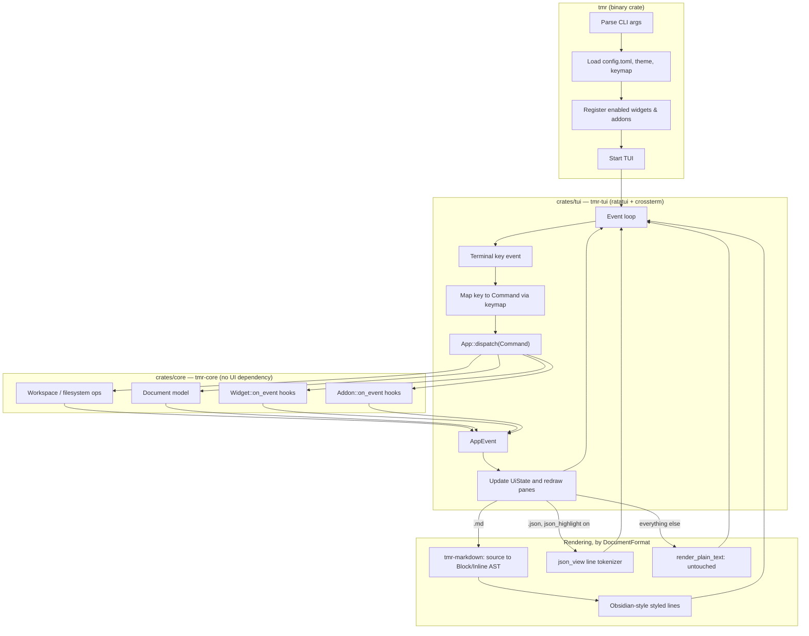

# Architecture

```
tmr/                    binary crate: CLI parsing, config/theme loading,
                         wiring addons/widgets, handing off to tmr-tui.
crates/core/  (tmr-core) the engine: workspace/filesystem ops, the
                         Document model, config, theme, keymap, the
                         Command → App::dispatch → AppEvent flow, and the
                         Widget/Addon trait abstractions. No UI dependency.
crates/markdown/         (tmr-markdown) Markdown source → a renderer-
              (tmr-markdown) agnostic Block/Inline AST (pulldown-cmark
                         under the hood), plus in-place checkbox toggling
                         on raw source text. No UI dependency either.
crates/tui/   (tmr-tui)  ratatui/crossterm presentation layer: converts
                         the AST to styled terminal lines, owns the
                         interaction/dialog state machine, the built-in
                         editor, image rendering, and the event loop.
```

The core never imports ratatui or crossterm — every operation flows
`Key event → Command → App::dispatch → AppEvent → redraw`, matching the
brief: the engine owns state and operations, the TUI only owns
presentation and translates raw terminal events into that engine's
vocabulary. A different frontend could be built against `tmr-core` and
`tmr-markdown` without touching either crate.

## How it works



Every keystroke makes one full lap of this loop: the TUI turns a raw
terminal key into a `Command`, the core's `App::dispatch` is the only
thing allowed to touch workspace/document/widget/addon state, and the
resulting `AppEvent` tells the TUI what to redraw — including, for the
Document pane, which of the three rendering paths below to take based on
the open file's `DocumentFormat`.

**Widgets.** `tmr_core::widget::Widget` is a small trait (enable/disable,
configure, tick, receive events, render as plain text lines) that a side
panel in the TUI draws generically. One example ships (`ClockWidget`) to
prove the trait works end to end — enable it with `[widgets] enabled =
["clock"]`. Building a real widget (a quick TODO list, a calendar) means
implementing the trait and registering it in `main.rs`; no TUI changes
required.

**Addons.** `tmr_core::addon::Addon` is a trait (load hook, event hook,
optional status-bar text) with **no dynamic loading** in this version —
addons are Rust structs compiled into the binary and enabled via
`[addons] enabled = [...]`. Rust's ABI instability makes `.so`-based
plugins a poor fit for a v1; this trait is the seam a future dynamic- or
WASM-based loader could sit behind without changing how addons are
written. One example ships (`StatsAddon`, a session file-op counter).

**Formats.** `tmr_core::document::DocumentFormat` distinguishes Markdown /
JSON / plain text / unknown by extension, and the TUI dispatches on it
(`crates/tui/src/input.rs::refresh_rendered`): `.md` gets the full
Obsidian-style rendering via `tmr-markdown`, `.json` gets a syntax-
highlighted rendering via `crates/tui/src/json_view.rs` **if** `[ui]
json_highlight` is on (off by default — falls through to the plain-text
path otherwise), and everything else falls through to
`markdown_view::render_plain_text` — untouched text, no parsing.
`json_view` is a self-contained line-local tokenizer rather than a
`tmr-markdown`-style AST crate: unlike Markdown, a JSON line's styling
doesn't depend on any block-level structure, so a per-line token scan is
enough and there was no renderer-agnostic tree worth building for it. A
format that *does* need block structure (YAML with nested mappings, say)
is still the case the `tmr-markdown`-sibling-crate pattern was written
for — see the `DocumentFormat`/`refresh_rendered` match either way; the
core's document/save/open flow already doesn't care what format it's
holding.

[← Back to README](../README.md)
