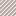

# Markdown showcase

A tour of everything tmr renders. Open this file, switch focus to the
Document pane (`Tab`), and scroll with `Up`/`Down`.

## Text formatting

A paragraph with **bold**, *italic*, ~~strikethrough~~, and `inline code`,
plus a [link](https://example.com).

## Lists

- unordered item one
- unordered item two
  - nested item

1. ordered item one
2. ordered item two

## Task list

- [x] an open task — put the cursor here and press `Space`
- [ ] a completed task
- [ ] a task with a nested sub-task
    - [ ] nested sub-task

## Code

Inline `code span`, and a fenced block:

```rust
fn main() {
    println!("hello from a code block");
}
```

## Quote

> A blockquote, rendered with a `>` margin.

## Table

| Feature      | Status |
|--------------|--------|
| Headings     | done   |
| Task lists   | done   |
| Tables       | done   |

## Thematic break

Above this line and below it:

---

## Image

A real local image, rendered as colored half-blocks if your terminal
reports truecolor support (`COLORTERM=truecolor`), otherwise shown as a
text placeholder:


